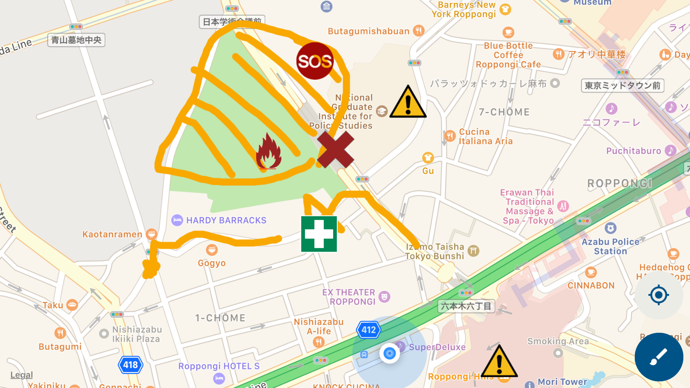

# Zenni

A real-time location sharing app for disasters  

## Features
- Livetrack your location on a map to see yourself
- See where other users are located on a map
- Create pins and notify other users of where the obstacles are such as blockages (such as a fallen tree, power lines, etc), dangerous zones, people in need, medical tents, refugee gathering areas, or you can customize your type of pins
- Draw and sketch on the map to add additional information about the area

## Getting Started

### Requirements
- NodeJS *v8.12.0*
- yarn
- react-native-cli (`yarn global add react-native-cli`)
- this repo `git clone https://github.com/cc5-team-red/zenni`
- for iOS: 
  - XCode *v9.4.1*
  - Cocoapods
- for Android:
  - Android Studio

### iOS
- **Prepare all requirements**
- `yarn ios:install`
- `yarn ios:start` to run the app in simulator.

This will run your app in development mode in an iPhone simulator.  
This will take time and patience, especially the first time.  
In the simulator, type `cmd + r` to refresh, and `cmd + d` to open settings.  
Remote JS Debugging (accessible from `cmd+d`) is hugely beneficial.  

### Android (unconfirmed)
- **Prepare all requirements**
- `yarn`
- `yarn android`

## Troubleshooting

- Make sure that you have the *correct versions* of requirements installed.
- Religiously read the react-native's [official troubleshooting tips](https://facebook.github.io/react-native/docs/troubleshooting.html)
- Deleting build files may solve your problems.  
  `yarn cleanse`  
  `yarn deep-cleanse` :trollface:

## About Us

### Our Mission
- Enable those who wish to help in a disaster a means to reach those who need it.
- Provide live tracking and sharing of key locations in a disaster.

### Contributing
Like what we do? [Contribute with us!](https://github.com/cc5-team-red/zenni/blob/develop/CONTRIBUTE.md)

### Developers:
- [@TsubasaK111](https://github.com/TsubasaK111) 
- [@kimikomotoyama](https://github.com/kimikomotoyama) 
- [@DennoDin](https://github.com/DennoDin) 